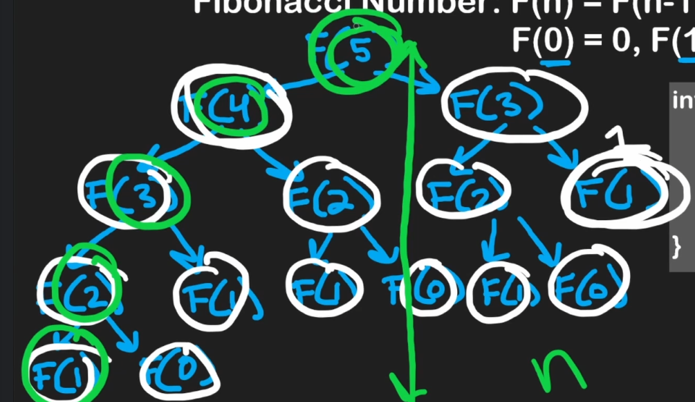
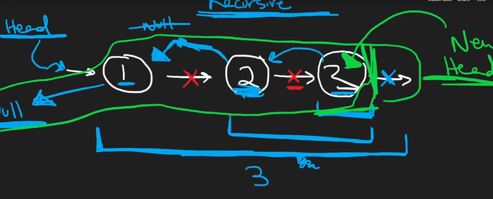

# Algorithms

## Time Complexity

The time of execution.

### Calculate

Remove the constants.
- We dont care about constants because constants only matter at smaller inputs which are insignificant to our CPU.
- If you mapped n^2 and 2n on a graph, 2n would be higher than n^2 in terms of runtime (y) only for smaller input (x). Eventually they would intersect and n^2 will always be bigger

### O(1)

Number of operations is constant relative to the input size.

USUALLY access is instant.

Not always fast, there could be 1000 operations and the time complexity could still be O(1).

### O(2n)

2 n's


 _ | _ | _ | _ | _
---------|----------|---------|---------|---------
 n | n | n | n | n
 n | n | n | n | n 

### O(n^2)

For every n is a n (square)

_ | _ | _ | _ | _
---------|----------|---------|---------|----------
 n | n | n | n | n
 n | n | n | n | n
 n | n | n | n | n
 n | n | n | n | n
 n | n | n | n | n

### Amortized

Average time per operation
- Used to ensure the average performance is acceptable, even if some individual operations might take longer

## Space Complexity

*Not as relevant as time complexity* 

## Edge case checking

> Input = anything you are operating on to get output

- **If you have input, you have to validate it.**
  - Not empty
  - Correct type
  - Need to compare? Input needs > 1
- **Never make any assumptions about your input**
- Check both edges literally (beginning and end)

## Recursion

Turning a problem into sub-problems until a base case is reached and then using the sub-problems to solve the more complex problem

recursive function = 
1. base case
2. recursive step: calling itself with smaller input

- When you think of recursion, think of stacks
  - it uses the call stack
  - When the base case it reached it uses the method call on top of the stack

Useful for:
- working backwards
  - reversing
  - depth first search on trees
- breaking problems into subproblems

### Operations & Complexity

O(n) space and complexity

- The equivalent loop would just be O(n) space complexity and not O(n) space complexity

The O(n) space complexity comes from the method calls getting put into the call stack and if there are n method calls there are n methods in the call stack

### Top-Down
aka Divisive or Decrease and Conquer or Divide and Conquer

Traditional Recursion, break the problem down into subproblems all the way to the base case and use that to solve the previous problem all the way back up to the original problem.

#### Memoization

Top-down recursion often uses memoization to store the results of already solved subproblems to avoid redundant calculations by ensuring a function is only called once for each subproblem.

#### Example 
```python
memo = {}  # memoization
def fib_top_down(n):
  if n <= 1:
    return n
  if n not in memo:
    memo[n] = fib_top_down(n-1) + fib_top_down(n-2)
  return memo[n]
```

### Bottom-Up
aka Aggregative or Dynamic Programming

Starts with the simplest subproblem (base case), then uses the subproblem to solve more complex subproblems all the way up to the original problem

#### Tabulation

Bottom-up recursion often uses tabulation to store the results of subproblems in a table (usually an array or a matrix) to ensure that each subproblem is only solve once.

#### Example
```python
def fib_bottom_up(n):
  if n <= 1:
    return n
  
  table = [0] * (n+1) # n+1 because we including 0
  table[1] = 1

  for i in range(2, n+1): # loop from 2 to n (0, 1 already handled)
    table[i] = table[i-1] + table[i-2] #this number is the result of the past 2 numbers
  
  return table[n]


```

#### Top-Down vs Bottom-up
[Link](https://medium.com/cracking-the-coding-interview-in-ruby-python-and/bottom-up-and-top-down-recursion-explained-with-examples-in-ruby-javascript-and-python-mastering-9fa051ee53ff)

Top-Down if:
- problem naturally breaks down into subproblems
- easier to conceptualize and implement for problems with a hierarchical or recursive structure
- Divide and Conquer

Bottom-up if:
- problem has a lot of overlapping subproblems
- useful when you know the base case
- Dynamic Programming

Top-down is easier to implement, but bottom-up is more efficient in time complexity (unless memoization is used for top-down) and in space complexity (tabulation is handled better in memory vs a call-stack can result in stack overflow)

## Sorting Algorithms

### Insertion sort

Best for when data is small

## Searching Algorithms

## Common Algorithms

### Shifting

Start at the beginning of the direction you are shifting
- Shifting everything to the left? Start at the left side
- Shifting everything to the right? Start at the right side

### In-place algorithm

Algorithm that doesnt require extra space proportional to the input size.

i.e. dont create another array for storing values, just edit the existing array

**How 2**:
1) Keep a Left pointer and a Right pointer
2) Update `R` w/ O(n) loop
   `for R in range(len(myList))`
3) Move the data at `R` to `L` when condition is met
   `if(myList[L] != myList[R])`
4) BE CAREFUL how you update `L`
   - Keep in mind if `L` starts at 0, +1 for the length of L elements 

### Get min

If data is sorted, getting min is O(1).

#### Static data

If the input is not changing, you can just get the minimum.

#### Dynamic data

However if the input is changing (added and removed from) and you need the minimum dynamically, then a minimum state stack should be used. 
This prevents having to find the minimum every time the data is changed.

Keep track of the minimum state at every entry of input
- input stack
- minimum state stack

Need to keep both stacks in sync. So if you push/pop from input stack you push/pop to the minimum state stack.

### Combine Linked Lists

<mark> DONT THINK OF LINKED LIST AS ARRAY</mark>

Tips:
- **Once one list runs out** you dont have to keep looping through the other! 
  - Just `new.next = list2`
  - Where `list2` is pointing to a node in the remaining list that hasnt been added yet
- Useful to have beginning be dummy node, then at the end of combining them you set head to dummy.next (the true head of the list)
  - That way you have a dedicated entry into new list

### Factorial

> `5! = 5 * 4 * 3 * 2 * 1`

A useful way of thinking of factorial sequence is that `5! = 5 * 4!`
- do you see how recursion can be used here?

```python
def factorial(num: int) -> int:
    if num == 1:
        return 1
    return num * factorial(num-1)
```

### Fibonacci

```python
from functools import cache

@cache  # memoization - it will cache the results of the function calls so that if the function is called again with the same input it will just return from the cache
def fibonacci(n):
  if n <= 0:
    return 0
  if n == 1:
    return 1
  return fibonacci(n-1) + fibonacci(n-2)
```

#### Get time complexity 

This example can help you understand how to get time complexity of a binary tree.



1) 1st level is 1 node, 2nd level is 2 nodes, 3rd level there is 4 nodes.
2) The pattern is the number of nodes is 2x / **doubles** the previous level
3) Double each at each level means multiple by 2 at each level which means **2^n**
4) Since we have to traverse to the last level, it is **O(n)**

### Reverse Linked List

Tip:
- Go to the tail of the linked list and start returning to the previous nodes
  - When returning to the previous nodes, always return the og tail
  - Just update the current node / head in that specific call to point backwards
    - `head.next.next = head`



```python3
# Definition for singly-linked list.
# class ListNode:
#     def __init__(self, val=0, next=None):
#         self.val = val
#         self.next = next
class Solution:
    def reverseList(self, head: Optional[ListNode]) -> Optional[ListNode]:
        if not (head and head.next): # Only one node (or empty list from the start)
            return head

        new_head = self.reverseList(head.next) # will always be 5 (the new head of the list)
        head.next.next = head # the next of head's next, point back at head
        head.next = None # old head points to None (since it's the end of a list)
        print(new_head)
        return new_head
```