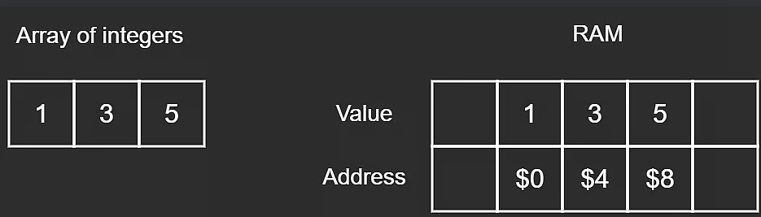

# Data Structures

## RAM

Random Access Memory

### Address

- Stores a byte value
- 4 bytes apart 

### Bit

1's and 0's

### Byte

1 byte = 8 bits

### Hexadecimal

1 hex = 4 bits

2 hex = 8 bits = 1 byte

## Array

Ordered, contiguous group of elements

